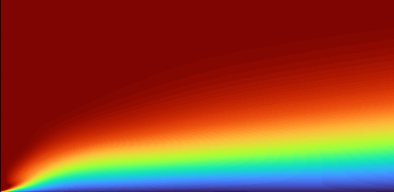
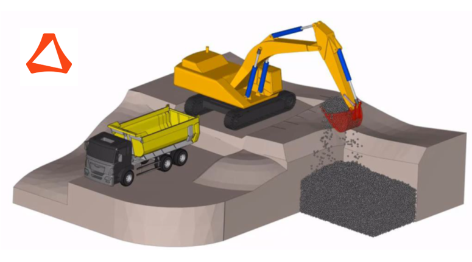

## Education

---

[Double Master's in Computational Mechanics - CIMNE](https://www.cimne.com/3136/pgs31/what-is-pcm/programme)

<a href = "https://www.upc.edu/en/masters/numerical-methods-in-engineering">Master's in Numerical Methods in Engineering - UPC Barcelona</a> 
2020 - 2021 
GPA - 8.58 

<a href = "https://www.commas.uni-stuttgart.de/">Master's in COMMAS - University of Stuttgart</a> 
2021 - Present 
	

---

## Work experience

---

### Research assistant - IKTD (University of Stuttgart)
[Using Deep Learning to improve shaft-hub friction coupling](/sample_page) 
Oct 2021- Present 

---

### Masters Intern - Basque Centre for Applied Mathematics

[Physics Informed Neural Networks (PINNs) for PDEs](/pdf/BCAM.pdf) 
Jan 2020 - Aug 2021 

---

### Advanced Trainee - Altair Engineering

[Development of multibody dynamics software - MotionView](/pdf/Project_summary.pdf) 
Feb 2019 - Aug 2020 

[Project 1 Title](http://example.com/)

---

---
<!--p style="font-size:11px">Page template forked from <a href="https://github.com/evanca/quick-portfolio">evanca</a></p-->
<!-- Remove above link if you don't want to attibute -->
